

    

------------------------------------------

## 1.  소개

  ### **취업을 위해 매일 코딩테스트를 풀고 있는 개발자들을 위한 코딩 문제 추천 서비스**

  🌊 Naming : 개발자(Developer)는 항상 코드를 봐 (look)라는 의미를 가지고 있습니다.
  
    개발자라면 꾸준하게 이용하게 되는 코딩 테스트 사이트인 백준과 연동하여 문제를 추천하는 서비스 입니다.

------------------------------------------------------

## 2. ⚙️ 주요 기능

**🖋 WF 초안**   

  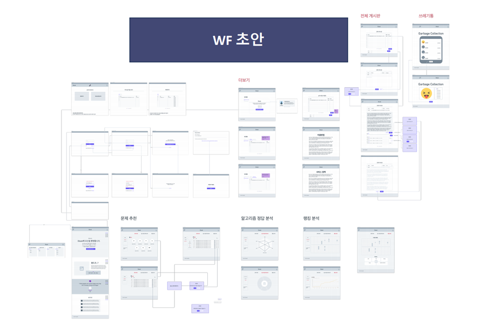

**🖋 Service Architecture**   

  

**🖋 메인 화면**   

  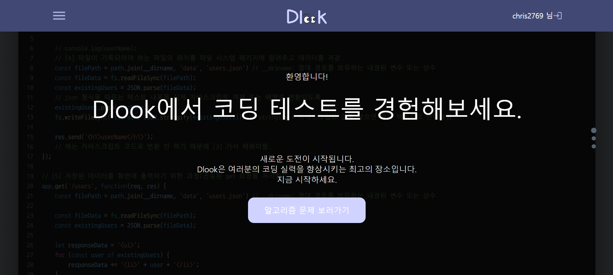
  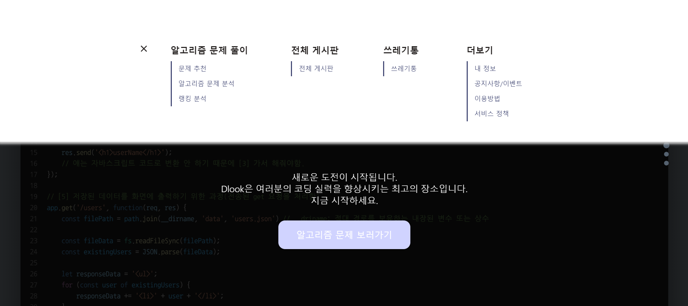
  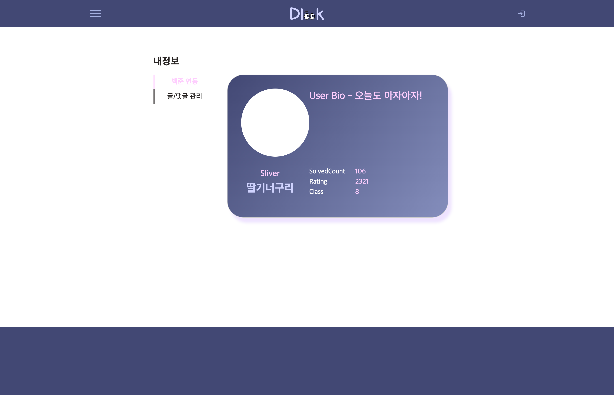

**1) 회원가입 및 로그인 기능 ( 이메일 인증 )**   
  
  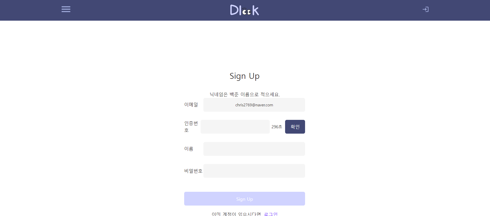

  

    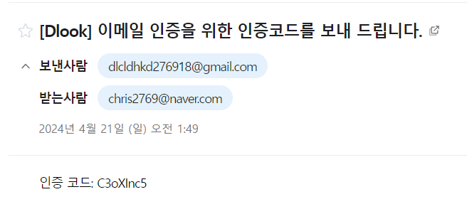
  
 

  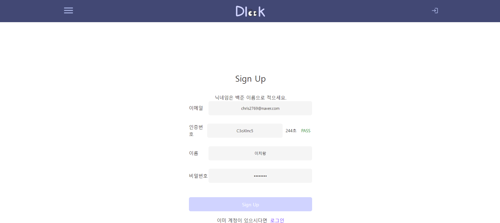

**2) 알고리즘 문제 추천 기능**

    - 실력별 추천 : 풀고자 하는 난이도에 해당하는 문제 10개를 추천
    
        - SolvedAc api를 활용하여 난이도에 해당하는 문제 추천

        - 난이도를 고른 후 문제 리스트에서 문제 제목을 클릭하는 경우 백준 사이트의 해당 문제로 이동

    - 원하는 알고리즘별 추천 : 풀고자 하는 알고리즘에 해당하는 문제 추천
    
        - SolvedAc api를 활용하여 알고리즘에 해당하는 문제 추천

  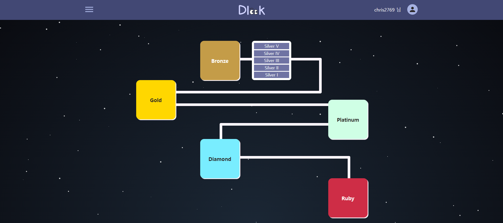
  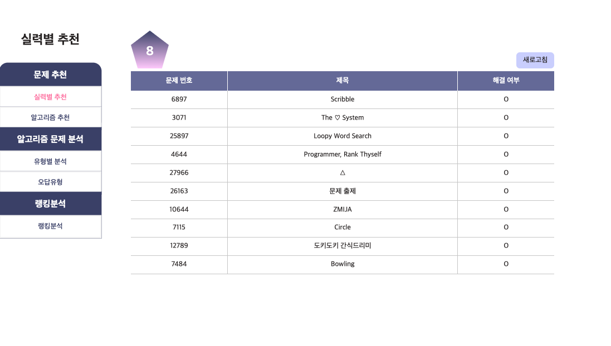
  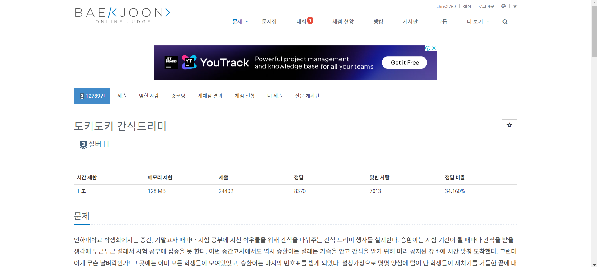
  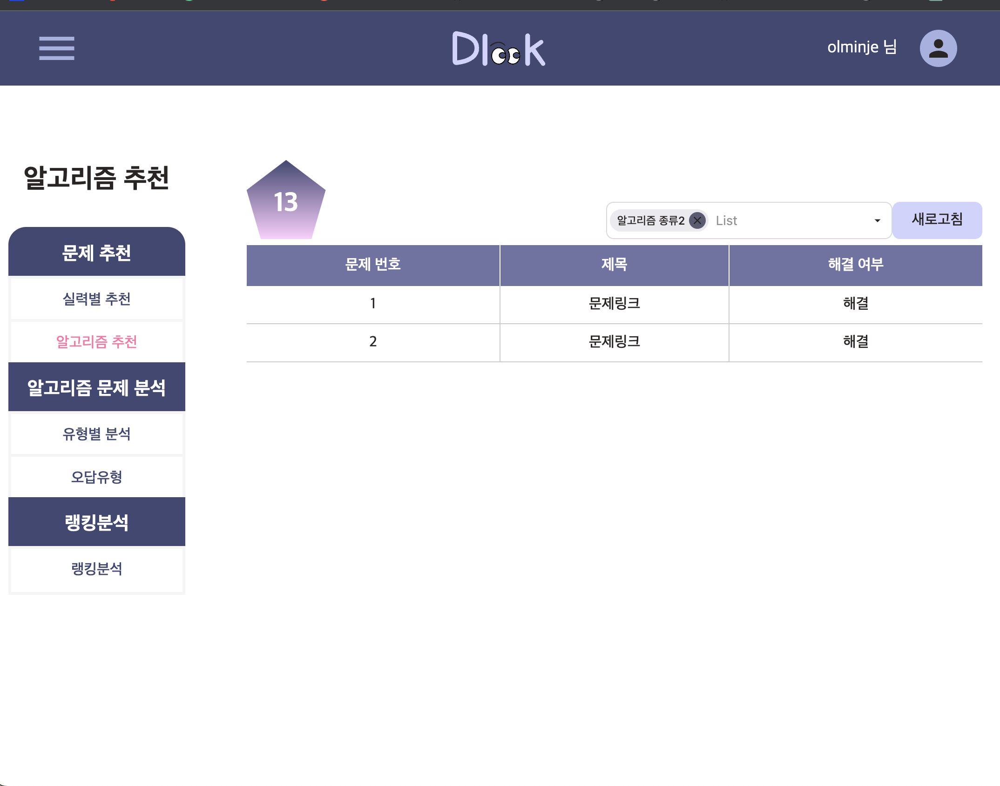

**3) 문제 분석 및 랭킹**

    - 오답 유형 분석 : 알고리즘별 오답 유형 파악

    - 랭크 분석 : 최장 스트릭, 레이팅, 현재 티어, 푼 문제, 스트릭 현황을 확인
    
        - SolvedAc api와 연동하여 사용자의 정보 확인

  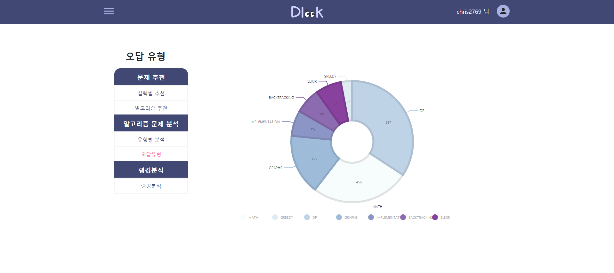
  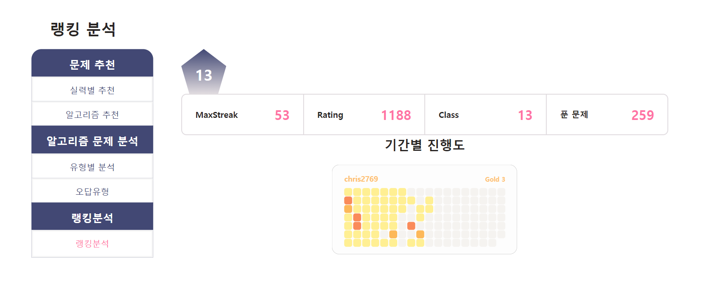

**4) 게시판 기능**   

  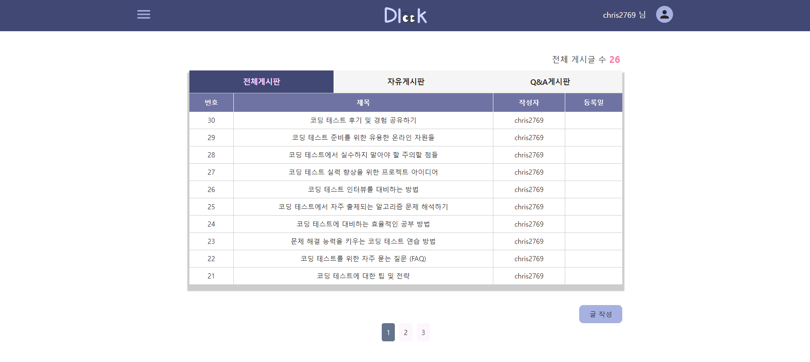

------------------------------------------------------

## 3. ⛓ Tech Stack

    <table border=""4>
        <th align="center">Role</th>
        <th style="text-align : center;" colspan="2">Framework</th>
        <!-- FrontEnd Stack -->
        <tr>
            <td rowspan="4" align="center"><b>FE</td>
            <td>&nbsp;&nbsp;<b>HTML</td>
            <td rowspan="3">Website Building Components</td>
        </tr>
        <tr>
            <td>&nbsp;&nbsp;<b>CSS</td>
        </tr>
        <tr>
            <td>&nbsp;&nbsp;<b>JavaScript</b></td>
        </tr>
        <tr>
            <td>&nbsp;&nbsp;<b>React</b></td>
            <td>Frontend Framework</tdi>
        </tr>
        <!-- Backend Stack -->
        <tr>
            <td rowspan="4" align="center"><b>BE</td>
            <td>&nbsp;&nbsp;<b>Java11-Spring</td>
            <td rowspan="2">Spring Server Framework</td>
        </tr>
        <tr>
            <td>&nbsp;&nbsp;<b>Spring Boot</td>
            <tr>
            <td>&nbsp;&nbsp;<b>JPA & Data JPA</td>
            <td rowspan=1>Data Processing Skills</td>
        </tr>
        <tr>
            <td>&nbsp;&nbsp;<b>MySQL 8.0</td>
            <td>Back-End Main Database</td>
        </tr>     
        <!-- Tools --> 
        <tr>
            <td rowspan="4" align="center"><b>Tools</td>
            <td>&nbsp;&nbsp;<b>Git</td>
            <td>Version Control System (VCS)</td>
        </tr>
        <tr>
            <td>&nbsp;&nbsp;<b>Notion</td>
            <td>Collaborative Productivity Platform</td>
        </tr>
        <tr>
            <td>&nbsp;&nbsp;<b>Google Slides</td>
            <td rowspan="2">Google Workspace Productivity Tools</td>
            <tr>
            <td>&nbsp;&nbsp;<b>Google Sheets</td>
        </tr>
    </table>

  

------------------------------------------------------

## 4. :octocat: Developers

 

    <table border=""4 width="50%">
        <tr>
            <th style="text-align : center;" colspan="2">FrontEnd</th>
            <th style="text-align : center;" colspan="2">Backend</th>
        </tr>
        <tr>
            <td align="center"><a href="https://github.com/OlMinJe"></td>
            <td align="center"><a href="https://github.com/loadraw"></td>
            <td align="center"><a href="https://github.com/noxknow"></td>
            <td align="center"><a href="https://github.com/gyuonnn"></td>
        </tr>
        <tr>
            <td align="center"><a href="https://github.com/OlMinJe">이민제</td>
            <td align="center"><a href="https://github.com/loadraw">황인환</td>
            <td align="center"><a href="https://github.com/noxknow">이치왕</td>
            <td align="center"><a href="https://github.com/gyuonnn">윤규원</td>
        </tr>
    </table>

